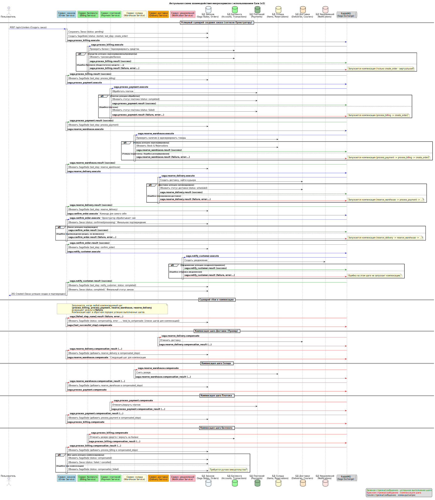

# Интернет-магазин на базе микросервисов Go

Проект представляет собой реализацию микросервисной архитектуры с использованием Go, Gin, GORM и RabbitMQ.

## Сервисы

Проект состоит из следующих микросервисов:

1. **Сервис заказов** - управление пользователями и заказами, координация саги заказа
2. **Сервис биллинга** - управление счетами пользователей и транзакциями
3. **Сервис нотификаций** - отправка и хранение уведомлений
4. **Сервис склада** - управление товарами и их резервирование
5. **Сервис доставки** - управление доставкой заказов
6. **Сервис платежей** - обработка платежных транзакций

## Взаимодействие между сервисами

- При создании пользователя в **сервисе заказов** автоматически создается аккаунт в **сервисе биллинга**
- При создании заказа в **сервисе заказов**:
    1. Запускается сага обработки заказа с следующими шагами:
        - Проверка и резервирование средств через **сервис биллинга**
        - Обработка платежа через **сервис платежей**
        - Резервирование товаров на складе через **сервис склада**
        - Резервирование доставки через **сервис доставки**
        - Подтверждение заказа внутри **сервиса заказов**
        - Отправка уведомления клиенту через **сервис нотификаций**
    2. В случае сбоя на любом шаге, выполняется компенсация предыдущих успешных шагов в обратном порядке
- **Единая аутентификация** между сервисами:
    1. JWT токен, полученный в любом сервисе, работает во всех сервисах системы
    2. Единый ключ подписи JWT и общие настройки обеспечивают бесшовную аутентификацию

## Технологии

- **Go** - язык программирования
- **Gin** - HTTP фреймворк
- **GORM** - ORM для работы с базой данных
- **PostgreSQL** - база данных
- **RabbitMQ** - брокер сообщений
- **Docker / Docker Compose** - контейнеризация и оркестрация

## Архитектура

Проект основан на принципах Clean Architecture:

- **Entity** - бизнес-модели
- **UseCase** - бизнес-логика
- **Repository** - работа с данными
- **Controller** - обработка запросов

### Особенности архитектуры

- **Общие компоненты** в директории `pkg/` для повторного использования в разных сервисах
- **Единая система аутентификации** на базе JWT с общим ключом для всех сервисов
- **Асинхронное взаимодействие** через RabbitMQ для обеспечения слабой связанности сервисов
- **Паттерн Saga (Оркестрация)** для обеспечения согласованности данных между сервисами при создании заказа

## Запуск проекта

### Предварительные требования

- Docker
- Docker Compose

### Запуск

```bash
# Клонировать репозиторий
git clone https://github.com/director74/dz8_shop.git
cd ./dz8_shop

# Запустить проект
docker-compose -f deployments/docker-compose.yml up -d
```

## E2E тестирование в Postman

Для полного тестирования взаимодействия между микросервисами созданы коллекции тестов Postman.

### Тестирование Саги (ДЗ №8)

Автоматизирует следующий сценарий:

1. Подготовка: регистрация пользователя, авторизация, пополнение баланса
2. Успешное выполнение саги:
    - Создание заказа
    - Проверка успешного прохождения всех этапов (биллинг, оплата, склад, доставка)
    - Проверка статуса заказа и связанных сущностей
3. Компенсация при сбое:
    - Создание заказа с недостаточным балансом
    - Проверка работы компенсирующих транзакций
    - Проверка итогового статуса заказа

### Как импортировать и запустить тесты:

1. Скачайте файлы коллекций из репозитория папка `tests/dz8`
2. В Postman нажмите кнопку Import и выберите скачанный файл
3. Запустите все сервисы проекта с помощью Docker Compose
4. В Postman выберите коллекцию и нажмите "Run"
5. Просмотрите результаты выполнения всех тестов

## Структура проекта

```
/
├── billing-service/       # Сервис биллинга
├── order-service/         # Сервис заказов
├── notification-service/  # Сервис нотификаций
├── warehouse-service/     # Сервис склада
├── delivery-service/      # Сервис доставки
├── payment-service/       # Сервис платежей
├── pkg/                   # Общие пакеты
├── migrations/            # Миграции баз данных
├── deployments/           # Конфигурация Docker Compose
├── build/                 # Скрипты сборки
├── tests/                 # Тесты Postman
├── docs/                  # Документация
└── README.md              # Документация
```

## Документация

### API Спецификация (Swagger)

API-интерфейсы всех сервисов документированы с использованием OpenAPI (Swagger).
Полные спецификации можно найти в файлах:
- [swagger.yaml (ДЗ №8)](docs/dz8/swagger.yaml)

### Диаграммы последовательности взаимодействия

Для визуализации взаимодействия между микросервисами созданы диаграммы последовательности в формате PlantUML:
- [Процесс саги обработки заказа (ДЗ №8)](docs/dz8/saga_flow_diagram.svg)

## Мониторинг

- RabbitMQ Management: http://localhost:15672 (guest/guest)

## API Методы

### Сервис аутентификации и заказов (порт 8080)

- **POST** `/api/v1/auth/register` - Регистрация нового пользователя (без авторизации)
- **POST** `/api/v1/auth/login` - Аутентификация пользователя (без авторизации)
- **POST** `/api/v1/users` - Создание пользователя (без авторизации)
- **POST** `/api/v1/orders` - Создание заказа (требует авторизации)
- **GET** `/api/v1/orders/{id}` - Получение заказа по ID (требует авторизации)
- **GET** `/api/v1/users/{id}/orders` - Получение списка заказов пользователя (требует авторизации)
- **GET** `/health` - Проверка работоспособности сервиса (без авторизации)

### Сервис биллинга (порт 8081)

- **POST** `/api/v1/accounts` - Создание аккаунта для биллинга (без авторизации)
- **GET** `/api/v1/accounts/{user_id}` - Получение информации об аккаунте пользователя (без авторизации)
- **GET** `/api/v1/billing/account` - Получение информации о своем аккаунте (требует авторизации)
- **POST** `/api/v1/billing/deposit` - Пополнение баланса (требует авторизации)
- **POST** `/api/v1/billing/withdraw` - Снятие средств с баланса (требует авторизации)
- **GET** `/health` - Проверка работоспособности сервиса (без авторизации)

### Сервис уведомлений (порт 8082)

- **POST** `/api/v1/notifications` - Отправка уведомления (без авторизации)
- **GET** `/api/v1/notifications` - Получение списка всех уведомлений (без авторизации)
- **GET** `/api/v1/notifications/{id}` - Получение уведомления по ID (без авторизации)
- **GET** `/api/v1/users/{id}/notifications` - Получение списка уведомлений пользователя (без авторизации)
- **GET** `/health` - Проверка работоспособности сервиса (без авторизации)

### Сервис платежей (порт 8083)

- **GET** `/api/v1/payments/{id}` - Получение платежа по ID (требует авторизации)
- **POST** `/api/v1/payments/process` - Обработка платежа (требует авторизации)
- **POST** `/api/v1/payments/{id}/cancel` - Отмена платежа (требует авторизации)
- **GET** `/api/v1/payments/by-order/{order_id}` - Получение платежа по ID заказа (требует авторизации)
- **GET** `/api/v1/payments/by-customer/{user_id}` - Получение платежей пользователя (требует авторизации)
- **GET** `/health` - Проверка работоспособности сервиса (без авторизации)
- **POST** `/internal/payments/process` - Внутренняя обработка платежа (без авторизации)
- **GET** `/internal/payments/by-order/{order_id}` - Внутреннее получение платежа по ID заказа (без авторизации)
- **POST** `/internal/payments/{id}/cancel` - Внутренняя отмена платежа (без авторизации)

### Сервис склада (порт 8084)

- **GET** `/api/v1/warehouse/{id}` - Получение товара по ID (без авторизации)
- **GET** `/api/v1/warehouse/product/{product_id}` - Получение товара по ID продукта (без авторизации)
- **GET** `/api/v1/warehouse` - Получение списка всех товаров (без авторизации)
- **POST** `/api/v1/warehouse/check` - Проверка наличия товаров (без авторизации)
- **GET** `/api/v1/warehouse/order/{order_id}` - Получение резерва по заказу (требует авторизации)
- **POST** `/api/v1/warehouse/reserve` - Резервирование товаров (требует авторизации)
- **POST** `/api/v1/warehouse/release` - Отмена резерва товаров (требует авторизации)
- **POST** `/api/v1/warehouse/confirm` - Подтверждение резерва товаров (требует авторизации)
- **GET** `/health` - Проверка работоспособности сервиса (без авторизации)
- **POST** `/internal/warehouse/reserve` - Внутреннее резервирование товаров (без авторизации)
- **POST** `/internal/warehouse/release` - Внутреннее отмена резерва (без авторизации)
- **POST** `/internal/warehouse/confirm` - Внутреннее подтверждение резерва (без авторизации)

### Сервис доставки (порт 8085)

- **GET** `/api/v1/delivery/{id}` - Получение доставки по ID (без авторизации)
- **GET** `/api/v1/delivery/order/{order_id}` - Получение доставки по ID заказа (без авторизации)
- **GET** `/api/v1/delivery/list` - Получение списка доставок (без авторизации)
- **POST** `/api/v1/delivery/check-availability` - Проверка доступности слотов доставки (без авторизации)
- **POST** `/api/v1/delivery/reserve` - Резервирование слота доставки (без авторизации)
- **POST** `/api/v1/delivery/release` - Освобождение слота доставки (без авторизации)
- **POST** `/api/v1/delivery/confirm` - Подтверждение доставки (без авторизации)
- **GET** `/health` - Проверка работоспособности сервиса (без авторизации)

## Тестирование

Для тестирования проекта разработаны наборы инструментов и документации, разделенные по домашним заданиям:

### Домашнее задание 8: Распределенные транзакции

Тестирование паттерна "Сага" для обработки заказа, включающей микросервисы:
- Сервис заказов (оркестратор)
- Сервис биллинга
- Сервис платежей
- Сервис склада
- Сервис доставки
- Сервис нотификаций

Детальная документация по тестированию: [tests/dz8/README.md](tests/dz8/README.md)

Процесс саги наглядно представлен в диаграмме последовательности 